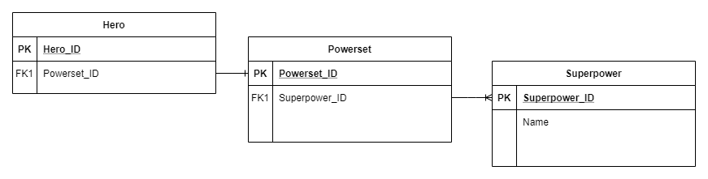
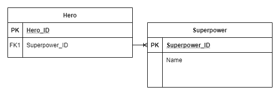
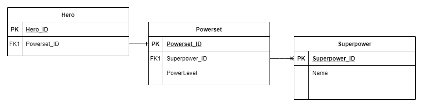
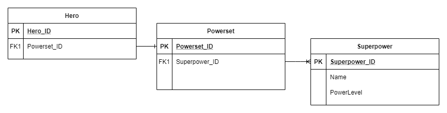

# 2NF - Second Normal Form

This is commonly where you'll see your first "join tables", and any databases you design to 2NF will really just be "3NF with unnecessary data". 

## Description

As all levels of normalization forms build upon the previous level, 2NF is just 1NF with that row-bloat problem solved. And it does it through this neat trick called a join table. It's a bit hard to explain - the examples below should make it clear. But basically, you want to keep an eye out for rows that are almost-duplicates of each other -- that means that you could simplify your data to meet 2NF! 

Fun fact: If you work with Ruby On Rails databases and use join tables & relationships between data, you almost-definitely hit 2NF already! 

## Rules

- Meets all requirements of 1NF.
- Has meaningful connection between column values and primary keys.

## Advantages

- Reduces row-bloat in database tables.
  - Oh my gosh, just look at the 1NF table in the example below. Row bloat *sucks*.
- Provides room for even better design of your data.

## Disadvantages

- Join tables can seem unnecessary.
- Relationships between tables can be tedious to set up correctly.

## Example

Here are the relevant 1NF tables that we'll use in this 2NF example:

| Hero ID | Name         | Alias ID | Franchise ID | City ID | Superpower ID | Age  | Birthday   |
| ------- | ------------ | -------- | ------------ | ------- | ------------- | ---- | ---------- |
| 001     | Bruce Wayne  | 001      | 001          | 001     | 001           | 30   | 17/04/1990 |
| 002     | Bruce Wayne  | 001      | 001          | 001     | 002           | 30   | 17/04/1990 |
| 003     | Bruce Wayne  | 001      | 001          | 001     | 003           | 30   | 17/04/1990 |
| 004     | Laurel Lance | 002      | 001          | 002     | 001           | 24   | 15/11/1995 |
| 005     | Laurel Lance | 002      | 001          | 002     | 004           | 24   | 15/11/1995 |
| 006     | Clark Kent   | 003      | 001          | 003     | 007           | 30   | 18/06/1990 |
| 007     | Clark Kent   | 003      | 001          | 003     | 006           | 30   | 18/06/1990 |
| 008     | Clark Kent   | 003      | 001          | 003     | 005           | 30   | 18/06/1990 |
| 009     | Dick Grayson | 004      | 001          | 001     | 001           | 23   | 01/12/1996 |

| Superpower ID | Name                |
| ------------- | ------------------- |
| 001           | Martial arts expert |
| 002           | Rich                |
| 003           | Master strategist   |
| 004           | Supersonic voice    |
| 005           | Super strength      |
| 006           | Heat vision         |
| 007           | Flight              |
| 008           | Super smart         |
| 009           | Supersuit           |
| 010           | Super healing       |
| 011           | Augmented skeleton  |
| 012           | Claws               |
| 013           | Super climbing      |

One of the biggest benefits of 2NF over 1NF is the ability to reduce row-bloat, by using ***join tables***! Here's an example of a 2NF-level database:

| Hero ID | Name         | Alias ID | Franchise ID | City ID | Powerset ID | Age  | Birthday   |
| ------- | ------------ | -------- | ------------ | ------- | ----------- | ---- | ---------- |
| 001     | Bruce Wayne  | 001      | 001          | 001     | 001         | 30   | 17/04/1990 |
| 002     | Laurel Lance | 002      | 001          | 002     | 002         | 24   | 15/11/1995 |
| 003     | Clark Kent   | 003      | 001          | 003     | 003         | 30   | 18/06/1990 |
| 004     | Dick Grayson | 004      | 001          | 001     | 004         | 23   | 01/12/1996 |

| Superpower ID | Name                |
| ------------- | ------------------- |
| 001           | Martial arts expert |
| 002           | Rich                |
| 003           | Master strategist   |
| 004           | Supersonic voice    |
| 005           | Super strength      |
| 006           | Heat vision         |
| 007           | Flight              |
| 008           | Super smart         |
| 009           | Supersuit           |
| 010           | Super healing       |
| 011           | Augmented skeleton  |
| 012           | Claws               |
| 013           | Super climbing      |

| Powerset ID | Superpower ID     |
| ----------- | ----------------- |
| 001         | (explained below) |
| 002         | (explained below) |
| 003         | (explained below) |
| 004         | (explained below) |

We've reduced the Hero table from 9 rows of data down to 4! That's a huge saving of bytes used by the database! 

However, this is where the row/column visuals of these examples start to fall apart. The join table of Powersets has a one-to-many relationship with Superpowers. One powerset can have many superpowers! This ERD might help:

And yes, in theory, you could have the Heroes directly have a one-to-many relationship with Superpowers. But then what if you have 2 superheroes with the same powerset? ...I mean, you could still just make the Heroes directly have a relationship with Superpowers. 

So this is where join tables bring in their own requirement: they should have at least one piece of extra data in the table. 

That structure represents overall hero power -- eg. Batman & Robin could have identical powersets, but Batman might be stronger. This also represents an issue of modification -- if you wanted to give Robin the superpower of super healing, what does that mean for the powerset's powerlevel? It's very nebulous and can lead to design or user experience problems later in the application's life.

So, you could add data to Superpowers table instead and keep your join-table skinny. This gives you finer control over data per power per powerset, while still reducing the amount of data you have to work with when working on your powerset table. Try to keep your references skinny if possible! 

That structure represents a finer control over superpower power levels -- eg. Batman and Captain America are both considered "master strategists" & "martial arts experts", but maybe Captain America is a better fighter or Batman is a better planner. If their Powerset had an overall power level number, that might be the same - but they do have different levels of their specific superpowers!

